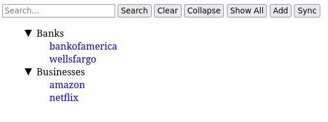
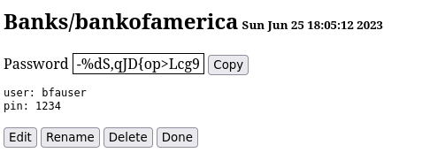
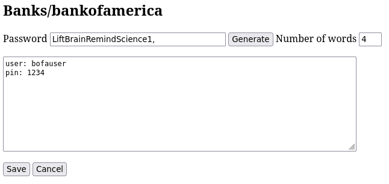

# Web frontend to Pass password store

<code>passweb</code> is a web-based front end to a
[pass](https://www.passwordstore.org) compatible password store.  The
<code>pass</code> application itself is not required to use <code>passweb</code>.

## Dependencies

* [Perl](https://www.perl.org)
* [HTTP::Server::Simple::CGI](https://metacpan.org/pod/HTTP::Server::Simple::CGI)
* [git](https://git-scm.com)
* [GnuPG](https://gnupg.org)
* [pinentry](https://www.gnupg.org/related_software/pinentry/index.html)

To install all the dependencies in Fedora:

<code>dnf install perl git gnupg pinentry-qt perl-HTTP-Server-Simple</code>

## Configuration

Make sure the pinentry program is specified in **~/.gnupg/gpg-agent.conf**

<code>pinentry-program /usr/bin/pinentry-qt</code>

If your remote password store <code>git</code> repository is accessed via
<code>ssh</code>, setup [ssh-agent](https://www.ssh.com/academy/ssh/agent).

## Running

Start <code>passweb</code> specifiying the path to your password store
and a port to use for the web interface:

<code>passweb ~/password-store 1234 &</code>

Point your browser to <code>http://localhost:1234</code>

## Running in a container

<code>passweb</code> may also be run in a container.  When running in a
container the <code>gpg</code> passphrase is entered via the web interface
instead of using the pinentry program.  This documentation describes how
to run the container using [Podman](https://podman.io) but it should
be similar for [Docker](https://www.docker.com).

### Building the container

<code>podman build -t passweb</code> .

### Initializing the container

The container uses a named volume for persistent storage.  The volume
contains the password store repository and <code>ssh</code> and
<code>git</code> configurations.

Use the <code>setup-container</code> script to initialize the volume.
Edit the variables at the top and run the script.  It will copy your
<code>gpg</code> configuration and <code>ssh</code> key to the volume.
Then it will clone the password repository.

### Running the container

```
podman run -d --rm --name passweb					      \
       -p 1234:1234							      \
       -v passweb:/home/passweb						      \
       -w /home/passweb							      \
       --user passweb							      \
       passweb passweb -c /home/passweb/password-store 1234
```

Adjust the port as necessary.  You may also use the <code>-t</code> option
to <code>passweb</code> to specify the timeout after which you need to
re-enter the <code>gpg</code> passphrase.  The default timeout is 60
seconds.  The container uses <code>ssh-agent</code> to provide the
<code>ssh</code> authentication for the <code>git</code> repository.  Your
<code>ssh</code> key password must be provided when the container is first
run:

```
podman exec -it passweb ./agent
```

Now the container is configured and running.  Point your browser to
<code>http://localhost:1234</code> Remember to re-run the agent script to
provide your <code>ssh</code> key password if you restart the container.

## Creating a <code>pass</code> compatible password store from scratch

```
gpg --gen-key				# generate gpg key
git init password-store			# initialize git repository
cd password-store
echo user@example.com > .gpg-id		# gpg id(s) to use for password store
git add .gpg-id
git commit -m "add .gpg-id" .gpg-id
```

## Screenshots

### Main

### View

### Edit


## License

_Licensed under the MIT License, Copyright (c) 2025 Greg Renda_
