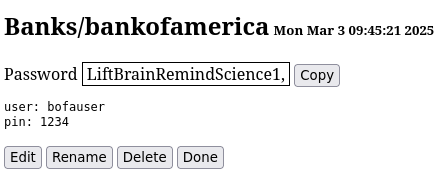

# Web frontend to Pass password store

<code>passweb</code> is a web-based front end to a
[pass](https://www.passwordstore.org) compatible password store.  The <code>pass</code> application itself is not required to use <code>passweb</code>.

## Dependencies

* [Perl](https://www.perl.org)
* [HTTP::Server::Simple::CGI](https://metacpan.org/pod/HTTP::Server::Simple::CGI)
* [git](https://git-scm.com)
* [GnuPG](https://gnupg.org)
* [pinentry](https://www.gnupg.org/related_software/pinentry/index.html)

To install all the dependencies in Fedora:

<code>dnf install perl git gnupg pinentry-qt perl-HTTP-Server-Simple</code>

## Configuration

Make sure the pinentry program is specified in **~/.gnupg/gpg-agent.conf**

<code>pinentry-program /usr/bin/pinentry-qt</code>

If your remote password store git repository is accessed via ssh, setup
[ssh-agent](https://www.ssh.com/academy/ssh/agent).

## Running

Start <code>passweb</code> specifiying the path to your password store
and a port to use for the web interface:

<code>passweb ~/password-store 1234 &</code>

Point your browser to <code>http://localhost:1234</code>

## Creating a <code>pass</code> compatible password store from scratch

```
gpg --gen-key				# generate gpg key
git init password-store			# initialize git repository
cd password-store
echo user@example.com > .gpg-id	# gpg id(s) to use for password store
git add .gpg-id
git commit -m "add .gpg-id" .gpg-id 
```

## Screenshots

### Main

### View

### Edit


## License

_Licensed under the MIT License, Copyright (c) 2023 Greg Renda_
